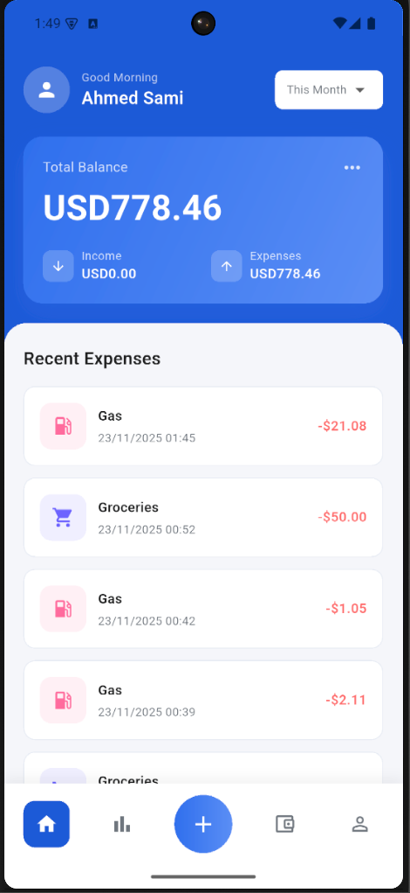
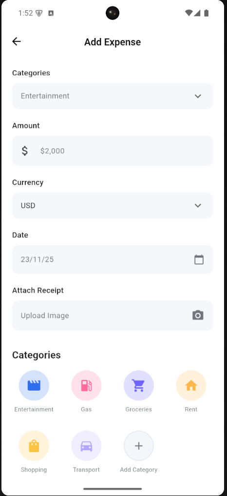
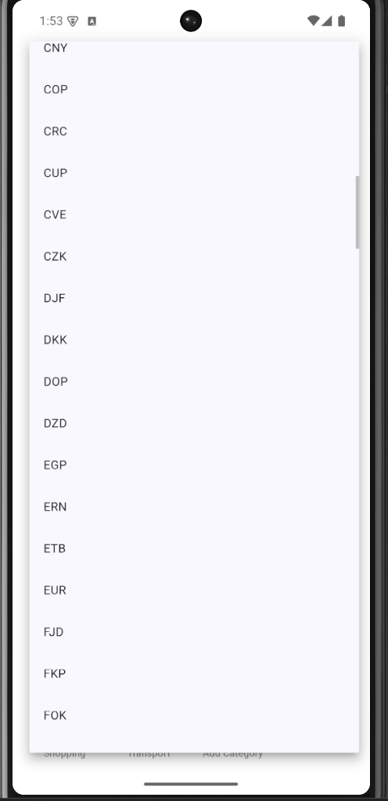

# Expense Tracker

A lightweight, offline-first expense tracking app built with Flutter using Clean Architecture and BLoC pattern.

## Screenshots

<p align="center">
  
  
  
</p>

## Features

- ✅ Track expenses with categories
- ✅ Currency conversion (160+ currencies)
- ✅ Offline-first with local storage
- ✅ Pagination & filtering
- ✅ Receipt upload
- ✅ Dashboard with summary

## Quick Start

```bash
# Install dependencies
flutter pub get

# Generate Hive adapters
flutter pub run build_runner build --delete-conflicting-outputs

# Run the app
flutter run
```

## Architecture

```
lib/
├── core/           # Shared utilities, DI, theme
├── features/       # Feature modules (dashboard, add_expense)
└── main.dart       # Entry point
```

**Stack**: Flutter 3.6+, BLoC, Hive, Dio, GetIt

## CI/CD

GitHub Actions workflows for:
- Code analysis & linting
- Android/iOS builds
- Artifact generation

See [.github/workflows/README.md](.github/workflows/README.md) for details.


